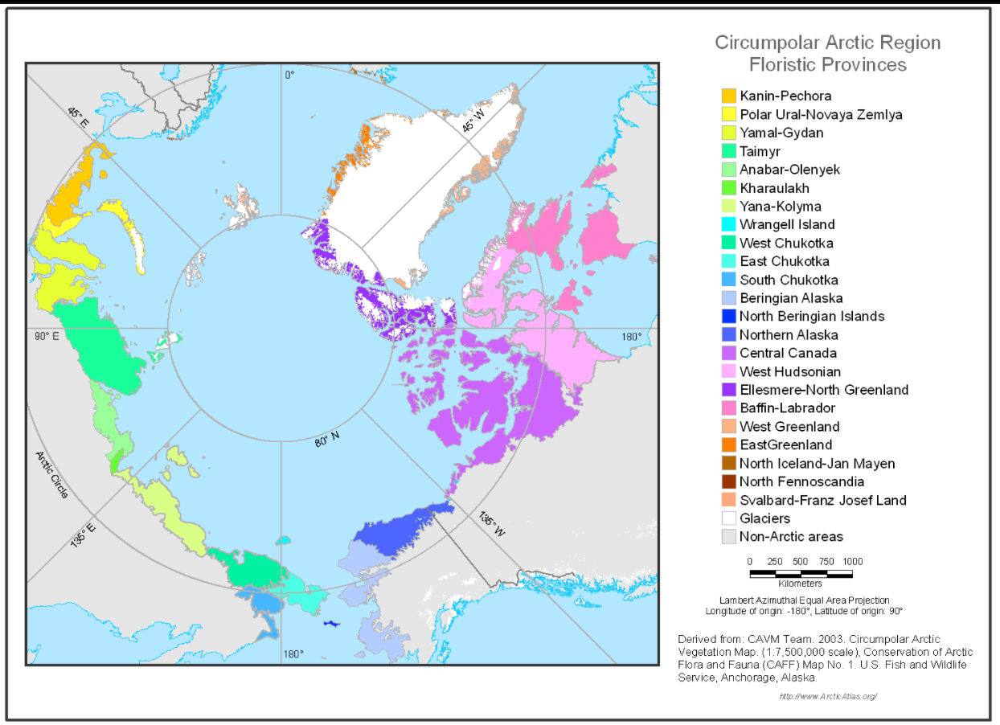

Making Floristic Regions and Provinces of North America. 

Yes, I actually had to do this. As in, no there is not a shapefile of this…. I think all botanists should collectively conclude we have our priorities skewed. I don't know what we have been up to but oh-golly-gee have we been distracted by silly stuff. 

Given how fuzzy floristic provinces boundaries are I feel OK compiling these data and drawing in the most of the remaining areas. The resolution of any of these lines is kind of arbitrary most the time anyways. 

However! Not all hope is lost, we actually do have some decent resources to get started! Woohoo!

The California Floristic Province [3]
The Western Warm Deserts (Sonoran, Mojave, Colorado) [4]
North American Boreal [2]
Arctic Floristic Provinces [1]
Biogeographic Regions of Mexico [5]

Sources: 

[1] http://www.arcticatlas.org/maps/themes/cp/cpfp, created by the Toolik-Arctic Geobotanical Atlas, at the University of Alaska Fairbanks, which is largely based on Elvebakk et. al 1999, and Yurtsev 1994. 

[2] Brandt, J.P., 2009. ‘The Extent of the North American Boreal Zone’. Environmental Reviews https://doi.org/10.1139/A09-004

[3] Burge, Dylan O. et al. (2016), Data from: Plant diversity and endemism in the California Floristic Province, Dryad, Dataset, https://doi.org/10.5061/dryad.d4g4n

[4] Faunt, Claudia. (2006). Deserts of the southwestern United States, for the Death Valley regional ground-water flow system study, Nevada and California

[5] Morrone, J.J., Escalente, T., Rodriguez-Tapia, G. 2017. ‘Mexican biogeographic provinces: Maps and shapefiles’ Zootaxa 4277 (2): 277-279


So even with these resources around we need to do a few things:


1) We need to erase areas from the Warm Deserts (WD) which overlap with the California Floristic Province (CFP). We are doing it this way, because the CFP map is a much higher resolution than the WD map. The WD was digitized an old book, CFP was purpose built by the Jeps folks just a few years ago.

2) Split the American Deserts, and reunite the Colorado into the Sonoran. 

3) We are going to unite the shapefiles for the Sonoran, with the Baja Peninsula, the Colorado Desert, and Sonoran Proince. These will create our Sonoran Floristic Province. 

4) I drew a polygon in QGIS which we will be able to clip to create most of the Vancouverian Province. We are able to clip this to the continental land mass of the North America, the CFP at one edge, some great basin on another, and the boreal extent on the other side! Note that the slightly contentious part of this is that I drew a line largely allocating the Methow (WA) to the North Rockies, because have you been to the Methow? (I still think anything past the true crest of the Cascades should be lumped with the Rockies as a moderately dry Montane element but w.e.)

5) We will clip the Mexican ecoregions to the holarctic*. It is kind of sad but I guess we should focus here, the mexican botanists kicked all of our asses and they have better resources for themselves anyways. 
* NOTE we are keeping the Sonoran despite it's lovely sub-tropical monsoony-ness. 

6) Clip the Arctic to North America and clean file.

7) Clip the Boreal to the Arctic.


# Libraries

These should be about what we need. 
```{r loadlib, results='hide', message=F, warning=F}
library(tidyverse)
library(sf)
library(sp)
library(rgdal)
library(raster)
library(smoothr)
library(rmapshaper)
library(sfheaders)
```

```{r, results='hide', message=F, warning=F}
cfp_sf <- readOGR(dsn = "cfp_products", verbose = FALSE, layer = "CFP_GIS") %>% 
  st_as_sf() %>% 
  st_transform(26911)
deserts_sf <- readOGR(dsn = "deserts_sw", verbose = FALSE, layer = "deserts_sw") %>% 
  st_as_sf() %>% 
  st_transform(26911)
```

# 1 & 2) Erase areas which overlap with the CFP map

As mentioned, because these polygons were created for different purposes they are of different resolutions. We want to remove the segments of the coarser vector file from the finger resolution vector file. We are pushing both systems to a planar projection that is very accurate in the area where we know these overlaps may be. Their are a couple issues with one of the files (not suprisingly the higher resolution one), and we will use two tricks to clean it. 

```{r, results='hide',  message=F}

st_is_valid(cfp_sf)
cfp_sf <- st_make_valid(cfp_sf)
cfp_sf <- sf::st_buffer(cfp_sf, dist = 0)

deserts_sf <- sf::st_buffer(deserts_sf, dist = 0)
deserts_sf_cleaned <- st_difference(deserts_sf, st_union(cfp_sf))

mojave <- deserts_sf_cleaned %>% 
  filter(NAME == 'Mojave Desert')
so_great_basin <- deserts_sf_cleaned %>% 
  filter(NAME == 'Great Basin')
Sonoran <- deserts_sf_cleaned %>% 
  filter(stringr::str_detect(NAME, 'Sonoran')) # just putting them together with the str_detect!

rm(deserts_sf, deserts_sf_cleaned)
```

# 3) Unite the Sonoran Desert
```{r, message = FALSE}
son_baj <- readOGR(dsn = "Provinces_Mexico", verbose = FALSE, layer = "Baja_Californian_province")
son_son <- readOGR(dsn = "Provinces_Mexico", verbose = FALSE, layer = "Sonoran_province")

son_baj_sf <- st_as_sf(son_baj) %>% 
  st_transform(26911)
son_son_sf <- st_as_sf(son_son) %>% 
  st_transform(26911)

Sonoran_1 <- st_union(Sonoran, son_baj_sf, son_son_sf)
Sonoran_1 <- st_union(Sonoran_1, son_son_sf)

Sonoran_Province <- Sonoran_1 %>% 
  dplyr::select(NAME, Region, geometry) %>% 
  rename(Subprovince = NAME) 

Sonoran_Province <-  st_difference(Sonoran_Province, st_union(cfp_sf))
plot(Sonoran_Province)

ggplot(Sonoran_Province) +
  geom_sf(aes(fill = Subprovince)) +
  geom_sf(data = cfp_sf, aes(fill = JEP_REG)) +
  geom_sf(data = mojave, aes(fill = NAME))

rm(son_baj, son_son, son_baj_sf, son_son_sf, Sonoran, Sonoran_1)
```

# 4 Buffer the Mojave to fill in the gaps between it and the other deserts.

We can see above, that their are small slivers between the Mojave and the CFP, along the the Sonoran. Because floristic province breaks are usually pretty gradual we are going to buffer out the Mojave so that it envelops some of the other areas. All of the gaps I can see anyone would happily call Mojave transition elements at the least. 

```{r}
mojave <- mojave %>% st_buffer(12000) # added 12km worth of buffer let's see...

ggplot(Sonoran_Province) +
  geom_sf(aes(fill = Subprovince)) +
  geom_sf(data = cfp_sf, aes(fill = JEP_REG)) +
  geom_sf(data = mojave, aes(fill = NAME)) +
  geom_sf(data = so_great_basin)
```

```{r, message=FALSE}

mojave1 <- st_difference(mojave, st_union(cfp_sf)) # removing from the cfp side of the mojave any overlapping areas
mojave1 <- st_difference(mojave1, st_union(Sonoran_Province)) # the same for the sonoran side. 
mojave1 <- st_difference(mojave1, st_union(so_great_basin)) # remove the upper buffer from the great basin. 

ggplot(Sonoran_Province) +
  geom_sf(aes(fill = Subprovince)) +
  geom_sf(data = cfp_sf, aes(fill = JEP_REG)) +
  geom_sf(data = mojave1, aes(fill = NAME)) +
  geom_sf(data = so_great_basin)

mojave <- mojave1 # just made this to show how this method works. 
rm(mojave1)
```


# 5 Get the Great Basin in there!
Okay so if you don't know yet, my internet handle on just about everything is steppe (out of steppe with the world!!), So this section is pretty near and dear to me. Their are a lot of ways to treat the Great Basin Floristic Province. We are going to just work on continuing to flesh out the borders now. We have a shapefile which is pretty OK for this - at least the Southern & Northern Portions. It extends the Snake River Plains too far into Montana for my liking (but honestly this area is freaking confluent with the GBFP more so than the Northern Rockies). So let's pull out what we want from this shapefile. 

First we are gonna square up our existing Southern GBFP file, which came from our Deserts shapefile. 

You can see the difference pretty nicely with this data sets! If I am correct, we can at least use this portion of the great basin to pull it flush with the Mojave and CFP, then we can 'union' it with other great basin polygons to get a good fit. This is really only a small part of the great basin, but because it is from the same data source as our mojave, we want to keep it. 

```{r, eval = F}
so_great_basin <- so_great_basin %>% st_buffer(20000) # one area is a little troublesome

so_great_basin <- st_difference(so_great_basin, st_union(cfp_sf)) # removing from the cfp side of the mojave any overlapping areas
so_great_basin <- st_difference(so_great_basin, st_union(mojave)) # the same for the sonoran side.

ggplot(Sonoran_Province) +
  geom_sf(aes(fill = Subprovince)) +
  geom_sf(data = cfp_sf, aes(fill = JEP_REG)) +
  geom_sf(data = mojave, aes(fill = NAME)) +
  geom_sf(data = so_great_basin, aes(fill = NAME))
```
Okay looks pretty good

```{r, message = FALSE}
great_basin <- readOGR(dsn = "great_basin_floristic", verbose = FALSE, layer = "floristic_provinces_sgca")
great_basin <- st_as_sf(great_basin)
great_basin <- st_transform(great_basin, 26911)

ggplot(great_basin) +
   geom_sf(aes(fill = Name)) +
   geom_sf_label(aes(label = Name)) # okay we see what we want

sects <- c('Southern Great Basin', 'Northern Great Basin', 'Snake River Plain')
  
great_basin1 <- great_basin %>% 
  filter(Name %in% sects) %>% 
  dplyr::select(-Id)

# Ok now we will split out each region and buffer it to fill the voids it has an adjacent polygon, we do this separately to minimize distortions of original units. We want to do as little buffering as possible

northern_great_basin <- great_basin1 %>% 
  filter(Name == 'Northern Great Basin')
snake_river_plain <- great_basin1 %>% 
  filter(Name == 'Snake River Plain')
southern_great_basin <- great_basin1 %>% 
  filter(Name == 'Southern Great Basin')  %>% 
  st_buffer(26000) # fills the largest gap, now let's cut back where we can. 

southern_great_basin <- st_difference(southern_great_basin, st_union(cfp_sf)) # removing from the cfp side of the mojave any overlapping areas
southern_great_basin <- st_difference(southern_great_basin, st_union(mojave)) # the same for the sonoran side.
southern_great_basin <- st_difference(southern_great_basin, st_union(northern_great_basin))
southern_great_basin <- st_difference(southern_great_basin, st_union(snake_river_plain))

northern_great_basin <- northern_great_basin %>% # a little large, but I know the areas where it is expanding and it is fine. A truly much better fit thatn vancouverian or rockies
  st_buffer(43000)

northern_great_basin <- st_difference(northern_great_basin, st_union(cfp_sf)) # remember we are pushing the warners to GBFP, they fit CFP better, but the surrounding lands are GBFP. 
northern_great_basin <- st_difference(northern_great_basin, st_union(southern_great_basin))
northern_great_basin <- st_difference(northern_great_basin, st_union(snake_river_plain))
columbia_plateau <- great_basin %>% 
  filter(Name == 'Columbia Basin') # we are also going to use the Columbia basin to remove some of this element. 
northern_great_basin <- st_difference(northern_great_basin,  st_union(columbia_plateau))

ggplot(southern_great_basin) +
  geom_sf(aes(fill = Name)) +
  geom_sf(data = cfp_sf, aes(fill = JEP_REG)) +
  geom_sf(data = mojave, aes(fill = NAME)) # +
  #geom_sf(data = so_great_basin, aes(fill = NAME))

ggplot(northern_great_basin) +
  geom_sf(aes(fill = Name)) +
  geom_sf(data = cfp_sf, aes(fill = JEP_REG)) +
  geom_sf(data = snake_river_plain, aes(fill = Name)) +
  geom_sf(data = southern_great_basin, aes(fill = Name)) +
  geom_sf(data = mojave, aes(fill = NAME)) +
  geom_sf(data = Sonoran_Province, aes(fill = Subprovince)) +
  geom_sf(data = columbia_plateau, aes(fill = Name))

rm(sects)

```
Somewhat following McLaughlin (1989) I am keeping the Columbia Plateau in a sense. I am splitting the element at the transverse mountains across oregon, to maintain a larger GBFP. While there are some similarities in a lot of that area with the CP, I think his data are slightly equivocal and a more natural implementation is keeping the basin larger. Obviously this, along with the Wyoming Basin, and much of central and central eastern Montana have much higher affinities to the GBFP than the Rocky Mountains, but I will need a collaborator for that battle. I have these data...

# 6 Clip the Arctic to North America

OK so this is a really cool file! It is all of the worlds arctic sub-provinces! but we are going to clip it back to North America.
we are going to create a bounding box to filter this polygon. 

```{r,  message=F}
arctic <- readOGR(dsn = "cp_florprov_la_shp", verbose = FALSE, layer = "cp_florprov_la")
arctic <- st_as_sf(arctic)
arctic # a CRS i bet most of us haven't seen before!
arctic <- st_transform(arctic, 4326)

plot(arctic) # notice these bleeding lines across it. so weird!

# st_is_valid(arctic) many falses
arctic <- st_make_valid(arctic)
# st_is_valid(arctic)
plot(arctic) # lines still here weird. 

# We use the easternmost point in Russia, because the Aleutian islands are too far west - but lack arctic areas.  We use the Easternmost point of greenland -11.8. 90 is the north pole and 50 is pretty dang low. 

box = c(xmin = -169.4, ymin = 50, xmax = -11.8, ymax = 90)

arctic <- arctic %>% 
  st_crop(box) %>% 
  dplyr::select(-Shape_Leng, -Shape_Area) %>% 
  mutate(PHYTO =  as.character(PHYTO)) 

rm(box)
```
Ok we have clipped, we still have some of Iceland but we going to remove it with it's attribute number, see below, I think it was '10'

One problem with this file aside from being apparently slightly corrupted, is that it does not come with an accessory .txt file or something else which serves as a key to the numeric indices explaining which subprovince is which.... But not all was lost, we were able to retrieve these data by hand by using their own maps. 

```{r, echo=FALSE, out.width = '50%', out.height = '50%'}

```
Alright let's update by hand, we are going to pad the numerics so we dont have false matches with the single digit codes. 

```{r,  message=F}

arctic$PHYTO = paste0('_', arctic$PHYTO, '_')
arctic <- arctic %>% 
  mutate(PHYTO = str_replace(PHYTO, '_81_', 'West Greenland')) %>% 
  mutate(PHYTO = str_replace(PHYTO, '_82_', 'West Greenland')) %>% 
  mutate(PHYTO = str_replace(PHYTO, '_83_', 'West Greenland')) %>% 
  mutate(PHYTO = str_replace(PHYTO, '_84_', 'West Greenland')) %>% 
  mutate(PHYTO = str_replace(PHYTO, '_91_', 'East Greenland')) %>% 
  mutate(PHYTO = str_replace(PHYTO, '_92_', 'East Greenland')) %>% 
  mutate(PHYTO = str_replace(PHYTO, '_93_', 'East Greenland')) %>% 
  mutate(PHYTO = str_replace(PHYTO, '_1_',  'North Beringian Islands')) %>% 
  mutate(PHYTO = str_replace(PHYTO, '_2_', 'Beringian Alaska')) %>% 
  mutate(PHYTO = str_replace(PHYTO, '_3_', 'Northern Alaska')) %>% 
  mutate(PHYTO = str_replace(PHYTO, '_4_', 'Central Canada')) %>% 
  mutate(PHYTO = str_replace(PHYTO, '_5_', 'West Hudsonian')) %>% 
  mutate(PHYTO = str_replace(PHYTO, '_6_', 'Baffin-Labrador')) %>% 
  mutate(PHYTO = str_replace(PHYTO, '_7_', 'Ellesmere-North Greenland')) %>% 
  filter(PHYTO != '_0_') %>% # this is ice. 
  filter(PHYTO != '_10_') %>% 
  filter(PHYTO != '_20_') %>% 
  filter(PHYTO != '_21_') %>% 
  filter(PHYTO != '_22_') %>% 
  filter(PHYTO != '_23_') %>% 
  rename('Subprovince' = PHYTO)

ggplot(arctic) +
   geom_sf(aes(fill = Subprovince)) #+
   geom_sf_label(aes(label = Subprovince))

```

# 7) Remove overlaps between the Boreal and Arctic region. 


```{r, eval = FALSE}
boreal <- readOGR(dsn = "boreal", verbose = FALSE, layer = "NABoreal")
boreal <- st_as_sf(boreal)
###
bor <- boreal %>% 
  filter(TYPE == 'BOREAL') %>% 
 dplyr::select(-HA, -COUNTRY)

bor <- st_union(bor)
bor <- st_as_sf(bor)

boreal <- boreal %>% 
  filter(TYPE != 'BOREAL') %>% 
 dplyr::select(-HA, -COUNTRY)
###
hemi_boreal <- boreal %>% 
  filter(TYPE == 'HEMIBOREAL') 

hemi_boreal <- st_union(hemi_boreal)
hemi_boreal <- st_as_sf(hemi_boreal)

boreal <- boreal %>% 
  filter(TYPE != 'HEMIBOREAL') 
###

high_alpine <- boreal %>% 
  filter(TYPE == 'H_ALPINE')

high_alpine <- st_union(high_alpine)
high_alpine <- st_as_sf(high_alpine)
  

low_alpine <- boreal %>% 
  filter(TYPE == 'B_ALPINE')

low_alpine <- st_union(low_alpine)
low_alpine <- st_as_sf(low_alpine)

types <- boreal %>% 
  distinct(TYPE) %>% 
  pull(TYPE)

types <- unique(types)
types

st_write(hemi_boreal, dsn =  "boreal_new/hemi_boreal_union.shp", package = "sf")
st_write(bor, dsn = "boreal_new/boreal_union.shp", package = "sf")
st_write(high_alpine, dsn = "boreal_new/high_alpine.shp", package = "sf")
st_write(low_alpine, dsn = "boreal_new/low_alpine.shp", packge = "sf")

alpine <- st_union(high_alpine, low_alpine)
alpine <- st_as_sf(alpine)

high_alp <- st_read("boreal_new/high_alpine.shp", quiet = T)
low_alp <- st_read("boreal_new/low_alpine.shp", quiet = T)
alpine <- st_union(high_alp, low_alp)

st_write(alpine, dsn = "boreal_new/alpine_union.shp", package = "sf")

plot(alpine)


```

```{r,message=F}

hemi_boreal <- st_read("boreal_new/hemi_boreal_union.shp", quiet = T)
boreal <- st_read("boreal_new/boreal_union.shp", quiet = T)
alpine <- st_read("boreal_new/alpine_union.shp", quiet = T)
high_alp <- st_read("boreal_new/high_alpine.shp", quiet = T)
low_alp <- st_read("boreal_new/low_alpine.shp", quiet = T)
# boreal_alp_union <- st_union(hemi_boreal, alpine)

high_alp <- rmapshaper::ms_simplify(high_alp, 
                                    keep = 0.2,
                                    method = "vis",
                                    weighting = 0.4,
                                    no_repair = FALSE
                                    )
high_alp <- st_make_valid(high_alp)

low_alp <- rmapshaper::ms_simplify(low_alp, 
                                   keep = 0.2,
                                   method = "vis",
                                   weighting = 0.4,
                                   no_repair = FALSE
                                   ) 
low_alp <- st_make_valid(low_alp)

boreal <- rmapshaper::ms_simplify(boreal,
                                   keep = 0.2,
                                   method = "vis",
                                   weighting = 0.4,
                                   no_repair = FALSE
                                  )
boreal <- st_make_valid(boreal)

hemi_boreal <- rmapshaper::ms_simplify(hemi_boreal,
                                  keep = 0.2,
                                   method = "vis",
                                   weighting = 0.4,
                                   no_repair = FALSE
                                  )
hemi_boreal <- st_make_valid(hemi_boreal)

boreal_union_simp <- st_union(boreal, hemi_boreal, low_alp, high_alp)
boreal_union_simp <- st_as_sf(boreal_union_simp)


boreal_union_simp <- st_collection_extract(boreal_union_simp, "POLYGON") # need to restrict to only polygon type geometries
boreal_union_simp <- st_make_valid(boreal_union_simp)
boreal_union_simp <- nngeo::st_remove_holes(boreal_union_simp) # first pass at this will remove most of the holes. 

area_thresh <- units::set_units(100, km^2)
boreal_union_simp <- smoothr::fill_holes(boreal_union_simp, threshold = area_thresh)
boreal_union_simp <- st_make_valid(boreal_union_simp)
boreal_union_simp <- st_union(boreal_union_simp)
boreal_union_simp <- rmapshaper::ms_simplify(boreal_union_simp,
                                  keep = 0.2,
                                   method = "vis",
                                   weighting = 0.4,
                                   no_repair = FALSE
                                  )
boreal_union_simp <- st_cast(boreal_union_simp, to = "POLYGON")

plot(boreal_union_simp[1])

rm(high_alp, low_alp, boreal, hemi_boreal, area_thresh)

```

# Add in the North American Coastal Plain

Alright this one was made, and kindly shared by, Jennifer Costanza at North Carolina State University. 

```{r}
coastal_plain <- readOGR(dsn = "Coastal_Plain/floristic_province", verbose = FALSE, layer = "coastal_plain_floristic_province_final_updated2020") %>% 
  st_as_sf() %>% 
  dplyr::select(Id)

plot(coastal_plain)
```


# Homemade shapefiles. 
All of these shapefiles were made in QGIS. Because there were vector files which we knew we would be able to clip to them a few of the exterior edges could be drawn on pretty quickly. 

# 8 Clip the Vancouverian Province

This is the first new province we are creating! Given that it is wedged between the Coast and several other regions we have shapefiles for it does not look to difficult! I created a rough sketch of the area in QGIS, and we will remove additional elements from it by use of the CFP, columbia Plateau, and Boreal shapefiles, and we will keep that which intersects the North American Land Mass! While it is not great because really these elements is confunded by a generalized arid montane element which crosses most of WNA*, what we have will be fine enough. 

```{r}
#rm(arctic, cfp_sf, columbia_plateau, box, great_basin, great_basin1, mojave, northern_great_basin, snake_river_plain, so_great_basin, Sonoran_Province, southern_great_basin)

van <- st_read('vancouverian_province/Vancouverian_province_raw.gpkg', quiet = TRUE)
bb <- st_bbox(van)
van <- van %>% 
  st_transform(32610) %>% 
  st_make_valid()

continent <- readOGR(dsn = "ne_10m_land", verbose = FALSE,  layer = 'ne_10m_land')
continent <- st_as_sf(continent) %>% 
  st_crop(., bb) %>% 
  st_transform(32610) %>% 
  st_make_valid() 

cfp_sf <- st_transform(cfp_sf, 32610)
columbia_plateau <- st_transform(columbia_plateau, 32610)
northern_great_basin <- st_transform(northern_great_basin, 32610)

van <- st_intersection(continent, van) # removing the water from here
van <- van %>% dplyr::select(-featurecla, -scalerank, -min_zoom)

van <- st_difference(van, st_union(columbia_plateau))
van <- st_difference(van, st_union(cfp_sf))
van <- st_difference(van, st_union(northern_great_basin))

ggplot(van) +
  geom_sf() +
  geom_sf(data = northern_great_basin) +
  geom_sf(data = columbia_plateau)

rm(bb)
```


# Start clipping the new shapefiles. 

We'll start with the Appachian element

```{r}
appachian <- readOGR(dsn = "appachian", verbose = FALSE, layer = "appachian_element")
appachian <- appachian %>% 
  st_as_sf() %>% 
  st_transform(32612) %>% 
  smooth(., method = "ksmooth") %>% 
  st_make_valid()

# appachian_us.chaikin <- smooth(appachian,  method = "chaikin")
# appachian_us.ksmooth <- smooth(appachian,  method = "ksmooth") # looks the best 
# appachian_us.spline <- smooth(appachian, method = "spline")
# appachian_us.densify <- smooth(appachian,  method = "densify")
#                                 
# plot(appachian_us.chaikin)
# plot(appachian_us.ksmooth)
# plot(appachian_us.spline)
# plot(appachian_us.densify)

Sonoran_Province <- Sonoran_Province %>% 
  st_transform(32612)

mojave <- mojave %>% 
  st_transform(32612) %>% 
  st_make_valid()

#mojave <- st_difference(mojave, st_union(appachian)) # remember our mojave was overbuffered on this edge. 
appachian <- st_difference(appachian, st_union(Sonoran_Province))

appachian %>% st_buffer(5000)
appachian <- st_difference(appachian, st_union(mojave))

ggplot(appachian) +
  geom_sf(aes(fill = id)) +
  geom_sf(data = Sonoran_Province) +
  geom_sf(data = mojave)
```

We need to union the Tamapaulpin of the US to Mexico. 
```{r}
coastal_plain <- st_transform(coastal_plain, 32614)

tamapaulin_us <- readOGR(dsn = "tamapaulin", verbose = FALSE, layer = "tamapaulin_us_2.18.2020") %>% 
  st_as_sf() %>% 
  st_transform(32614) %>% 
  smooth(., method = "ksmooth")

# here we are looking for the best smooth to my nasty edgy polygon. I added it in the line above - at the end of the pipe. 

# tamapaulin_us.chaikin <- smooth(tamapaulin_us, method = "chaikin")
# tamapaulin_us.ksmooth <- smooth(tamapaulin_us, method = "ksmooth") # looks the best 
# tamapaulin_us.spline <- smooth(tamapaulin_us, method = "spline")
# tamapaulin_us.densify <- smooth(tamapaulin_us, method = "densify")

# plot(tamapaulin_us.chaikin)
# plot(tamapaulin_us.ksmooth)
# plot(tamapaulin_us.spline)
# plot(tamapaulin_us.densify)

tamaulipas <- readOGR(dsn = "Provinces_Mexico", layer = "Tamaulipas_province") %>% 
  st_as_sf() %>% 
  st_transform(32614)

tamapaulin <- st_union(tamaulipas, tamapaulin_us, by_feature = F) %>% 
  dplyr::select(id, geometry)

tamapaulin <- st_difference(tamapaulin, st_union(coastal_plain))

plot(tamapaulin)
rm(tamaulipas, tamapaulin_us)
```

# Prairies province

```{r}
prairies <- readOGR(dsn = "prairie_province", verbose = FALSE, layer = "prairies_2.18.21") %>% 
  st_as_sf() %>% 
  st_transform(32614) %>% 
  smoothr::smooth(., method = "ksmooth") %>% 
  st_make_valid()

plot(prairies)

boreal_union_simp <- st_transform(boreal_union_simp, 32614)
boreal_union_simp <- st_make_valid(boreal_union_simp)
prairies <- st_difference(prairies, st_union(boreal_union_simp))

prairies <- st_cast(prairies, to = 'POLYGON')
prairies <- prairies %>% 
  mutate(area = st_area(prairies)) %>% 
  mutate(area = as.numeric(area)) %>% 
  filter(area >= 10000000) %>% 
  st_union() %>% 
  st_as_sf() %>% 
  st_make_valid()
  
```


# Rocky Mountains

We also made these in qgis.... let's make them look OK. We are going to first use them to erase parts of our boreal layer. We are then going to use our rockies to clip the vancouverian province. 

```{r}
can_rockies <- readOGR(dsn = "rocky_mountain", verbose = FALSE, layer = "rockies_2.18.2020") %>% 
  st_as_sf() %>% 
  st_transform(32612) %>% 
  smoothr::smooth(method = "ksmooth") %>% 
  st_buffer(2000) %>% 
  st_make_valid()

can_rockies <- st_union(can_rockies)
can_rockies <- st_as_sf(can_rockies)

prairies <- prairies %>% st_transform(32612)
columbia_plateau <- columbia_plateau %>% st_transform(32612)
snake_river_plain <- snake_river_plain %>% st_transform(32612)

can_rockies <- st_difference(can_rockies, st_union(prairies))
can_rockies <- st_difference(can_rockies, st_union(columbia_plateau))
can_rockies <- st_difference(can_rockies, st_union(snake_river_plain))

# Now we will clip our vancouverian province to the rockies
vancouverian <- st_transform(van, 32612)
vancouverian <- st_make_valid(vancouverian)
vancouverian <- st_difference(vancouverian, st_union(can_rockies))

ggplot(can_rockies) + 
  geom_sf() + 
  geom_sf(data = prairies) + 
  geom_sf(data = columbia_plateau) + 
  geom_sf(data = snake_river_plain) +
  geom_sf(data = vancouverian) +
  geom_sf(data = northern_great_basin) +
  geom_sf(data = cfp_sf)
  

```
cleaning up the boreal region and vancouverian using the rockies
```{r,  message=F}
# boreal_union_simp <- st_transform(boreal_union_simp, 32612)
# boreal_union_simp <- st_make_valid(boreal_union_simp)
can_rockies <- st_make_valid(can_rockies)
can_rockies <- st_transform(can_rockies, 32612)

# boreal_union_simp <- st_difference(st_make_valid(boreal_union_simp), can_rockies) # weird error here, when creating the NEW polygon, this results based on rgeos where the new poly needs to be made valid before saved to new object. Is also the solution blessed by Edzar. https://github.com/r-spatial/sf/issues/870

can_rockies <- st_difference(can_rockies, st_union(prairies))

boreal_union_simp <- st_transform(boreal_union_simp, 32605)

van <- st_transform(van, 32605)
van <- st_make_valid(van)
van <- st_difference(van, st_union(boreal_union_simp))

van_cast <- st_cast(van, to = "POLYGON")
van_cast <- van_cast %>% 
  mutate(area = st_area(van_cast)) %>%  
  mutate(area =  as.numeric(area)) %>% 
  filter(area >= 1000) %>% 
  st_union() %>% 
  st_as_sf() %>% 
  st_make_valid()

ggplot(van_cast) +
  geom_sf() +
  geom_sf(data = northern_great_basin) +
  geom_sf(data = can_rockies)

rm(van)
```


# Chihuahuan
```{r,  message=F}
chi_us <- readOGR(dsn = "chihuahuan", verbose = FALSE, layer = "chihuahuan") %>% 
  st_as_sf() %>% 
  st_transform(32613) %>% 
  smoothr::smooth(., method = "ksmooth") %>% 
  st_buffer(3000)

chi_mx <- readOGR(dsn = "Provinces_Mexico", layer = "Chihuahuan_Desert_province") %>% 
  st_as_sf() %>% 
  st_transform(32613)

plot(chi_us)

Sonoran_Province <- st_transform(Sonoran_Province, 32613)
mojave <- st_transform(mojave, 32613)
appachian <- st_transform(appachian, 32613)
tamapaulin <- st_transform(tamapaulin, 32613)
can_rockies <- st_transform(can_rockies, 32613)

chi_us <- st_difference(chi_us, st_union(Sonoran_Province))
chi_us <- st_difference(chi_us, st_union(mojave))
chi_us <- st_difference(chi_us, st_union(appachian))
chi_us <- st_difference(chi_us, st_union(tamapaulin))

ggplot(chi_us) +
  geom_sf(aes(fill = id)) +
  geom_sf(data = appachian) +
  geom_sf(data = tamapaulin) +
  geom_sf(data = Sonoran_Province)

chihua <- st_union(chi_mx, chi_us) %>% 
  st_cast("POLYGON") 

chihua <- st_union(chihua) %>% 
  st_cast("POLYGON") %>% 
  st_as_sf()

can_rockies <- st_difference(can_rockies, st_union(chihua)) # now lets clean up the southern rockies

ggplot(chihua) +
  geom_sf() +
  geom_sf(data = appachian) +
  geom_sf(data = tamapaulin) +
  geom_sf(data = Sonoran_Province)

rm(chi_us, chi_mx)

```

# Colorado Plateau

We used McLaughlins system, clarified by the boundaries of the IMF crew to the Utah Plateaus. 

```{r,  message=F}
appachian <- st_transform(appachian, 32612)
great_basin1 <- st_transform(great_basin1, 32612)
can_rockies <- st_transform(can_rockies, 32612)
mojave <- st_transform(mojave, 32612)

co_plateau <- readOGR(dsn = "colorado_plateau", verbose = FALSE, layer = "colorado_plateau") %>% 
  st_as_sf() %>% 
  st_transform(32612) %>% 
  smoothr::smooth(., method = "ksmooth")

co_plateau <- st_difference(co_plateau, st_union(appachian))
co_plateau <- st_difference(co_plateau, st_union(mojave))
co_plateau <- st_difference(co_plateau, st_union(can_rockies))

ggplot(co_plateau) +
  geom_sf() +
  geom_sf(data = appachian) +
  geom_sf(data = great_basin1) +
  geom_sf(data = can_rockies) +
  geom_sf(data = Sonoran_Province) +
  geom_sf(data = chihua) + 
  geom_sf(data = mojave) +
  geom_sf(data = prairies) +
  geom_sf(data = tamapaulin) +
  geom_sf(data = cfp_sf) +
  geom_sf(data = columbia_plateau)  +
  geom_sf(data = van_cast)

```

# Appalachian 
Saved it for last. Make of it what you will. 

```{r,  message=F}
continent <- readOGR(dsn = "ne_10m_land", verbose = FALSE, layer = 'ne_10m_land') %>%
  st_as_sf() %>% 
  st_transform(4326) %>% 
  st_make_valid()

appalachian <- readOGR(dsn = "appalachian", verbose = FALSE, layer = "Appalachian2") %>% 
  st_as_sf() %>% 
  st_transform(4326) %>% 
  smoothr::smooth(., method = "ksmooth")

appalachian <- st_intersection(continent, appalachian) %>% 
  dplyr::select(id, geometry)

prairies <- st_transform(prairies, 32614)
appalachian <- st_transform(appalachian, 32614)
appalachian <- st_difference(appalachian, st_union(prairies))

tamapaulin <- st_transform(tamapaulin, 32614)
appalachian <- st_difference(appalachian, st_union(tamapaulin))

appalachian <- st_transform(appalachian, 32616)
coastal_plain <- st_transform(coastal_plain, 32616)
appalachian <- st_difference(appalachian, st_union(coastal_plain))

boreal_union_simp <- st_transform(boreal_union_simp, 32616)
boreal_union_simp <- st_make_valid(boreal_union_simp)
appalachian <- st_difference(appalachian, st_union(boreal_union_simp))

appalachian <- appalachian %>% dplyr::select(id)

appalachian <- st_cast(appalachian, to = "POLYGON")
appalachian <- appalachian %>% 
  mutate(area = st_area(appalachian)) %>% 
  mutate(area =  as.numeric(area)) %>% 
  filter(area >= 100000000) %>% 
  st_union() %>% 
  st_as_sf() %>% 
  st_make_valid()

ggplot(appalachian) +
  geom_sf() +
  geom_sf(data = prairies) +
  geom_sf(data = tamapaulin) +
  geom_sf(data = coastal_plain)
```

# Clean up polygons and prepare to combine them into a single layer. 


first we need to fix up the fit between the boreal and arctic areas.
```{r}
boreal_union_simp <- st_transform(boreal_union_simp, 4326)
bb_bor <- st_bbox(boreal_union_simp) 

arctic <- st_transform(arctic, 32612)
boreal_union_simp <- st_transform(boreal_union_simp, 32612)
prairies <- st_transform(prairies, 32612)
can_rockies <- st_transform(can_rockies, 32612)
appalachian <- st_transform(appalachian, 32612)
appalachian <- st_make_valid(appalachian)
van_cast <- st_transform(van_cast, 32612)
van_cast <- st_make_valid(van_cast)

continent <- readOGR(dsn = "ne_10m_land", verbose = FALSE,  layer = 'ne_10m_land') %>% 
  st_as_sf(continent)

continent <- continent %>% 
  st_transform(4326) %>% 
  st_make_valid() %>%
  st_crop(., bb_bor) %>% 
  st_make_valid() %>% 
  st_transform(32612)

boreal_union_simp <- st_buffer(boreal_union_simp, 50000) # need to go real big because of some area in Northwestern canada. 
boreal_union_simp <- st_intersection(continent, boreal_union_simp)
boreal_union_simp <- st_difference(boreal_union_simp, st_union(arctic))
boreal_union_simp <- st_difference(boreal_union_simp, st_union(prairies))
boreal_union_simp <- st_difference(boreal_union_simp, st_union(can_rockies))
boreal_union_simp <- st_difference(boreal_union_simp, st_union(appalachian))
boreal_union_simp <- st_difference(boreal_union_simp, st_union(van_cast))

boreal_union_simp <- st_union(boreal_union_simp)

boreal_union_simp %>% 
  st_cast(boreal_union_simp, to = "POLYGON") %>% 
  st_as_sf() %>% 
  mutate(area = as.numeric(st_area(boreal_union_simp))) %>%  
  mutate(area =  as.numeric(area)) %>% 
  filter(area >= 1000)

rm(bb_bor)
plot(boreal_union_simp[1])

continent <- st_transform(continent, 4326)
```

```{r}

rm(snake_river_plain, great_basin, alpine, southern_great_basin, northern_great_basin, so_great_basin)

appachian <- appachian %>% 
  mutate(Province = 'Sonoran') %>% 
  mutate(Province_Code = 'SON') %>% 
  mutate('Sub_Province' = "Appachian Element") %>% 
  mutate('Sub_Province_Code' = 'APA') %>% 
  st_transform(4326) %>% 
  dplyr::select(-id) 

appalachian <- appalachian %>% 
  mutate(Province = 'Appalachian') %>% 
  mutate(Province_Code = 'APP') %>% 
  mutate('Sub_Province' = "Appalachian") %>% 
  mutate('Sub_Province_Code' = 'APP') %>% 
  st_transform(4326) %>% 
  rename(geometry = x)

arctic <- arctic %>% 
  mutate(Province = 'Arctic') %>% 
  mutate(Province_Code = 'ARC') %>% 
  st_transform(4326) %>% 
  mutate('Sub_Province_Code' = case_when(
    Subprovince == 'North Beringian Islands' ~ 'NBI',
    Subprovince == 'Beringian Alaska' ~ 'BAK',
    Subprovince == 'Northern Alaska' ~ 'NAK',
    Subprovince == 'Central Canada' ~ 'CCA',
    Subprovince == 'West Hudsonian' ~ 'WHU',
    Subprovince == 'Baffin-Labrador' ~ 'BLA',
    Subprovince == 'Ellesmere-North Greeenland' ~ 'ENG',
    Subprovince == 'West Greenland' ~ 'WGR',
    Subprovince == 'East Greenland' ~ 'EGR'
    )) %>% 
    rename('Sub_Province' = Subprovince)

boreal_union_simp <- boreal_union_simp %>% 
  st_as_sf() %>% 
  mutate(Province = 'Boreal') %>% 
  mutate(Province_Code = 'BOR') %>% 
  mutate('Sub_Province' = "Boreal") %>% 
  mutate('Sub_Province_Code' = 'BOR') %>% 
  st_transform(4326) %>% 
  rename(geometry = x)

cfp_sf <- cfp_sf %>% 
  dplyr::select(JEP_REG, geometry) %>% 
  mutate(Province = 'California Floristic Province') %>% 
  mutate(Province_Code = 'CFP') %>% 
  st_transform(4326) %>% 
    mutate('Sub_Province_Code' = case_when(
    JEP_REG == 'Northern Channel Islands District' ~ 'NCHL',
    JEP_REG == 'Southern Channel Islands District' ~ 'SCHL',
    JEP_REG == 'Southwestern California Region' ~ 'SW',
    JEP_REG == 'Central Western California Region' ~ 'CW',
    JEP_REG == 'Cascade Ranges Region' ~ 'CAR',
    JEP_REG == 'Sierra Nevada Region' ~ 'SN',
    JEP_REG == 'Great Valley Region' ~ 'GV',
    JEP_REG == 'Northwestern California Region' ~ 'NW',
    JEP_REG == 'Oregon CFP' ~ 'OCFP',
    JEP_REG == 'Nevada CFP' ~ 'NCFP',
    JEP_REG == 'Baja CFP' ~ 'BCFP'
  ))  %>% 
  dplyr::rename('Sub_Province' = JEP_REG)

chihua <- chihua %>% 
  mutate(Province = 'Chihuahuan') %>% 
  mutate(Province_Code = 'CHI') %>% 
  mutate('Sub_Province' = 'Chihuahuan') %>% 
  mutate('Sub_Province_Code' = 'CHI') %>% 
  st_transform(4326) 

coastal_plain <- coastal_plain %>% 
  mutate(Province = 'Coastal Plain') %>% 
  mutate(Province_Code = 'CPL') %>% 
  mutate('Sub_Province' = 'Coastal Plain') %>% 
  mutate('Sub_Province_Code' = 'CPL') %>% 
  st_transform(4326) %>% 
  dplyr::select(-Id)

columbia_plateau <- columbia_plateau %>% 
  mutate(Province = 'Rocky Mountain') %>% 
  #mutate('Sub_Province' = 'Columbia Plateau') %>% 
  mutate(Province_Code = 'ROC') %>% 
  mutate('Sub_Province_Code' = 'COP') %>% 
  st_transform(4326) %>% 
  dplyr::select(-Id, -Name)

co_plateau <- co_plateau %>% 
  mutate(Province = 'Great Basin') %>% 
  mutate(Province_Code = 'GBA') %>% 
  mutate('Sub_Province' = 'Colorado Plateau') %>% 
  mutate('Sub_Province_Code' = 'COP') %>% 
  st_transform(4326) %>% 
  dplyr::select(-id)

can_rockies <- can_rockies %>% 
  mutate(Province = 'Rocky Mountain') %>% 
  mutate(Province_Code = 'ROC') %>% 
  mutate('Sub_Province' = 'ROC') %>% 
  mutate('Sub_Province_Code' = 'ROC') %>% 
  st_transform(4326) %>% 
  rename(geometry = x)

mojave <- mojave %>% 
  mutate(Province = 'Mojave') %>% 
  mutate('Sub_Province' = 'Mojave') %>% 
  mutate(Province_Code = 'MOJ') %>% 
  mutate('Sub_Province_Code' = 'MOJ') %>% 
  st_transform(4326) %>% 
  dplyr::select(-NAME)
  
great_basin1 <- great_basin1 %>% 
  mutate(Province = 'Great Basin') %>% 
  mutate('Sub_Province' = 'Great Basin') %>% 
  mutate('Sub_Province_Code' = case_when(
    Name == 'Snake River Plain' ~ 'SRP',
    Name == 'Southern Great Basin' ~ 'SGB',
    Name == 'Northern Great Basin' ~ 'NGB'
  )) %>% 
  mutate(Province_Code = 'GBA') %>% 
  st_transform(4326) %>% 
  dplyr::select(-Name)
  
tamapaulin <- tamapaulin %>% 
  mutate(Province = 'Tamapaulin') %>% 
  mutate('Sub_Province' = 'Tamapaulin') %>% 
  mutate(Province_Code = 'TAM') %>% 
  mutate('Sub_Province_Code' = 'TAM') %>% 
  st_transform(4326) %>% 
  dplyr::select(-id)

prairies <- prairies %>% 
  mutate(Province = 'North American Prairies') %>% 
  mutate('Sub_Province' = 'North American Prairies') %>% 
  mutate(Province_Code = 'NAP') %>% 
  mutate('Sub_Province_Code' = 'NAP') %>% 
  st_transform(4326) %>% 
  rename(geometry = x)

columbia_plateau <- columbia_plateau %>% 
  mutate(Province = 'Rocky Mountain') %>% 
  mutate(Province_Code = 'ROC') %>% 
  mutate('Sub_Province_Code' = 'CPL') %>% 
  mutate('Sub_Province' = 'Columbia Plateau') %>% 
  st_transform(4326) 

Sonoran_Province <- Sonoran_Province %>%
  mutate(Province = "Sonoran") %>%
  group_by(Province) %>%
  summarise() %>% 
  st_transform(4326) %>% 
  st_make_valid()

Sonoran_Province <- Sonoran_Province %>% 
  mutate(Province = 'Sonoran') %>% 
  mutate(Province_Code = 'SON') %>% 
  mutate('Sub_Province' = 'Sonoran Province') %>% 
  mutate('Sub_Province_Code' = 'SON') %>% 
  st_transform(4326)

vancouverian <- van_cast %>% 
  mutate(Province = 'Vancouverian') %>% 
  mutate(Province_Code = 'VAN') %>% 
  mutate('Sub_Province' = 'Vancouverian Province') %>% 
  mutate('Sub_Province_Code' = 'VAN') %>% 
  st_transform(4326) %>% 
  rename(geometry = x)
  
dest <- bind_rows(appachian,
              appalachian, 
              arctic, 
              boreal_union_simp,
              cfp_sf, 
              chihua, 
              co_plateau,
              coastal_plain,
              columbia_plateau, 
              great_basin1,
              mojave, 
              prairies,
              can_rockies,
              Sonoran_Province,
              tamapaulin,
              vancouverian
              ) %>% 
  st_make_valid()

ggplot()+
  geom_sf(data = dest, aes(fill = Province)) +
  theme_bw() +
  coord_sf(xlim = c(-180, -11.5), 
           ylim = c(19.5, 84))


dest <- st_make_valid(dest)

rm(appachian,appalachian, arctic, cfp_sf,  chihua,  co_plateau, coastal_plain, columbia_plateau,  great_basin1, mojave, prairies, can_rockies, Sonoran_Province, tamapaulin, vancouverian, van_cast, boreal_union_simp, boreal)

```
# Remove the great lakes from the province maps.

They are a lot of water, people will likely have issues with making good maps without these areas being removed from the layer

```{r}
getwd()
directory <- "C:/Users/reedb/OneDrive/Desktop/Botany materials/floristic_provinces/great_lakes"
files <- list.files(directory, pattern = '.shp$', recursive = TRUE)

erie <- st_read('great_lakes/hydro_p_LakeErie/hydro_p_LakeErie.shp', quiet = T)
huron <- st_read('great_lakes/hydro_p_LakeHuron/hydro_p_LakeHuron.shp', quiet = T)
super <- st_read('great_lakes/hydro_p_LakeSuperior/hydro_p_LakeSuperior.shp', quiet = T)
michi <- st_read('great_lakes/hydro_p_LakeMichigan/hydro_p_LakeMichigan.shp', quiet = T)
st.clair <- st_read('great_lakes/hydro_p_LakeStClair/hydro_p_LakeStClair.shp', quiet = T)
ontar <- st_read('great_lakes/hydro_p_LakeOntario/hydro_p_LakeOntario.shp', quiet = T)

great_lakes <- rbind(erie, huron, super, st.clair, ontar, michi)
great_lakes <- st_union(great_lakes) %>% 
  st_cast("POLYGON") %>% 
  st_as_sf() %>% 
  st_transform(4326)

dest1 <- st_difference(dest, st_union(great_lakes))

rm(erie, huron, super, michi, st.clair, ontar)
plot(great_lakes)
plot(dest1[1])
```


```{r}
test <- st_collection_extract(
  dest1,
  type = "POLYGON",
  warn = FALSE
)

plot(test[1])
st_write(test, "Draft_provinces.shp",  driver = "ESRI Shapefile")
```


# Cleaning the Coastlines. 

Per request, we are going to clean up the shapefiles so they are flush with the coasts

```{r}

download.file("http://data.alex-singleton.com/r-helpsheets/3/data.zip", "data.zip")
# Unzip file
unzip("data.zip")

# Read in Shapefile
Wards <- readOGR(".", "england-caswa_2001")

```